# eval-agent — system design

Detailed Mermaid diagrams of the eval-agent architecture. Mirrors the
four pillars laid out in [`INTERVIEW.md`](../INTERVIEW.md): agent
harness, AI memory, evaluation pipeline, experimentation system.

Each diagram below is renderable in any Mermaid-aware viewer (GitHub,
Obsidian, VS Code with the Mermaid extension, [mermaid.live](https://mermaid.live/)).

---

## 1 · Two-agent split (Anthropic harness)

The initializer bootstraps the environment once. Every subsequent
session is a Worker run with a mandatory startup procedure.

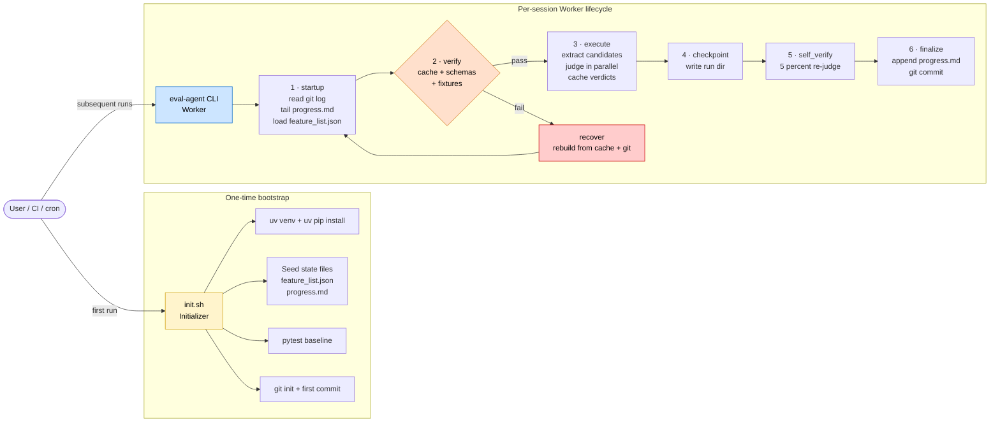

---

## 2 · Memory hierarchy

Four explicit layers, each backed by a file. Working memory lives in
the running process; episodic / semantic / procedural live on disk and
survive crashes, restarts, and OS reboots.

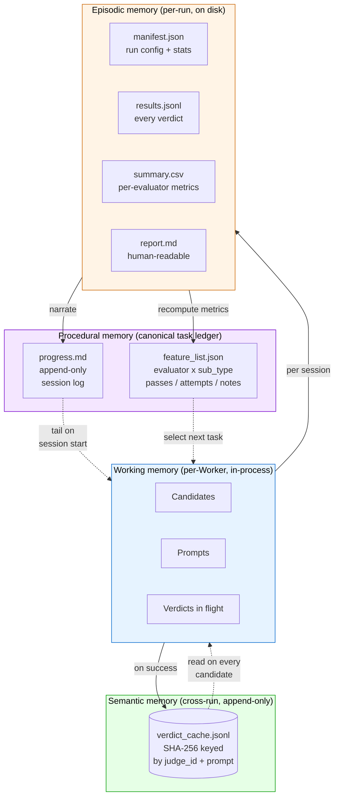

**Invariants:**

- `progress.md` is append-only. Corrections are new entries below, never edits.
- `feature_list.json` entries are never deleted — only `status` is mutated.
- `verdict_cache.jsonl` is append-only. Cache key = `SHA-256(judge_id ‖ prompt)`. Switching judges invalidates the cache cleanly.
- Episodic memory under `state/runs/<ts>/` is read-only after the run finishes.

---

## 3 · End-to-end run dataflow

A single `make run` from candidate extraction to report emission.

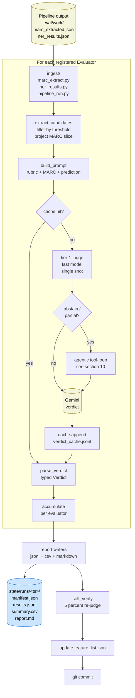

---

## 4 · Module boundaries

Strict layering: CLI ─→ Orchestration ─→ Evaluators + Client + Cache.
Ingest is one-way (reads pipeline files); evaluators never call ingest
directly from outside this graph.

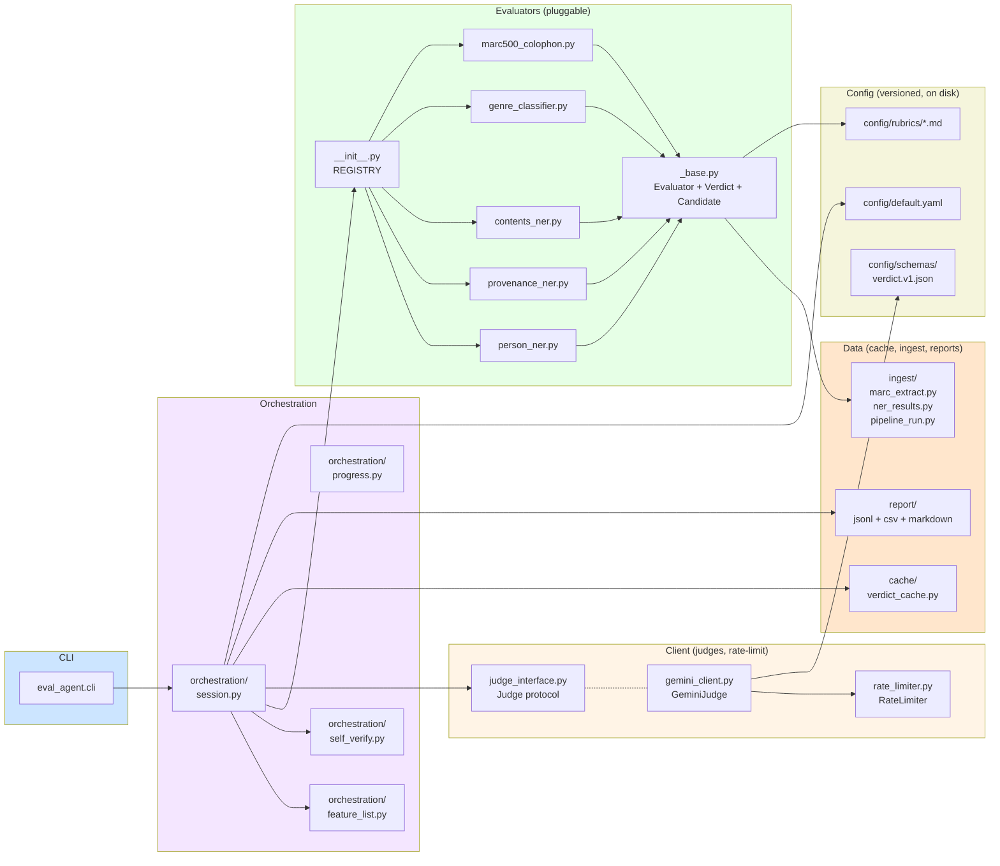

---

## 5 · Pluggable Judge interface

A new judge (Claude, GPT, local model) plugs in by implementing the
`Judge` protocol. The orchestration layer doesn't care which judge is
running — only the cache key does (so cross-judge contamination is
impossible).

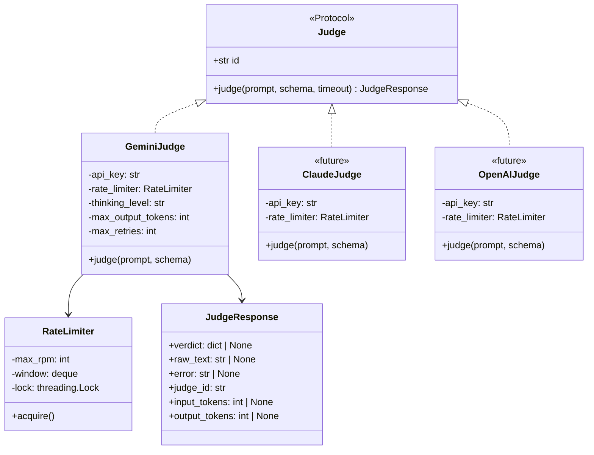

---

## 6 · Pluggable Evaluator interface

Adding evaluation of a new pipeline stage (e.g. Stage 3 authority
resolution) is **one new module** + one rubric + one registry entry.
No core code touched.

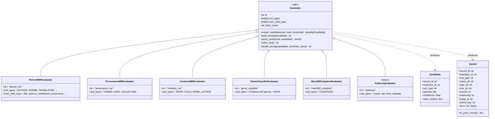

---

## 7 · File-coupling boundary with the parent pipeline

The eval-agent is a sibling project to the MHM Pipeline. **Only files
cross the boundary** — no Python imports, no shared modules, no
shared dependencies (apart from stdlib + JSON).

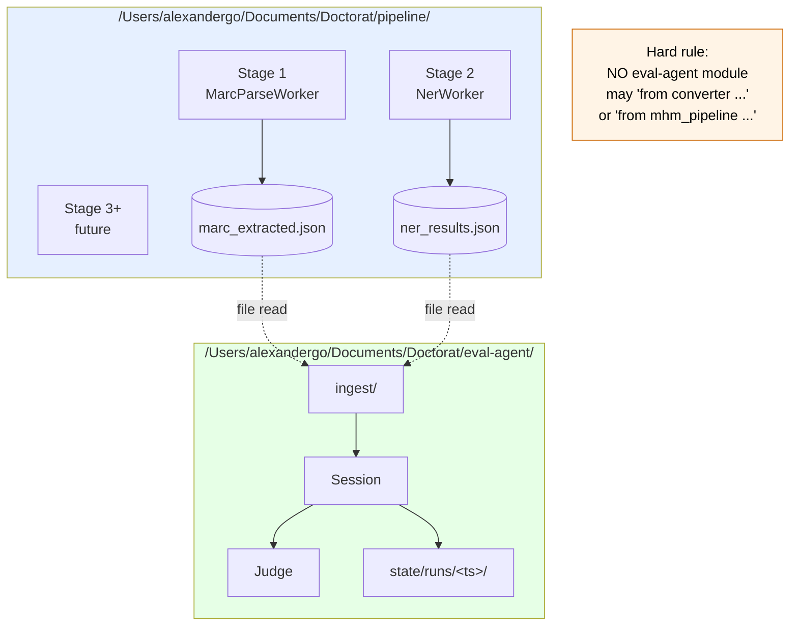

The MHM Pipeline doesn't know the eval-agent exists. The eval-agent
reads only public JSON files. This means:

- Pipeline can refactor freely; eval-agent only breaks if the JSON
  schema changes (caught by ingest unit tests).
- Eval-agent can ship as its own project, open-source-able, with no
  pipeline dependency footprint.
- The Tenzai-style "harness as separate concern" pattern: the agent
  that *runs* the system is separate from the *system being run*.

---

## 8 · Session-startup procedure (Anthropic pattern, detailed)

What a Worker does before it's allowed to start new work.

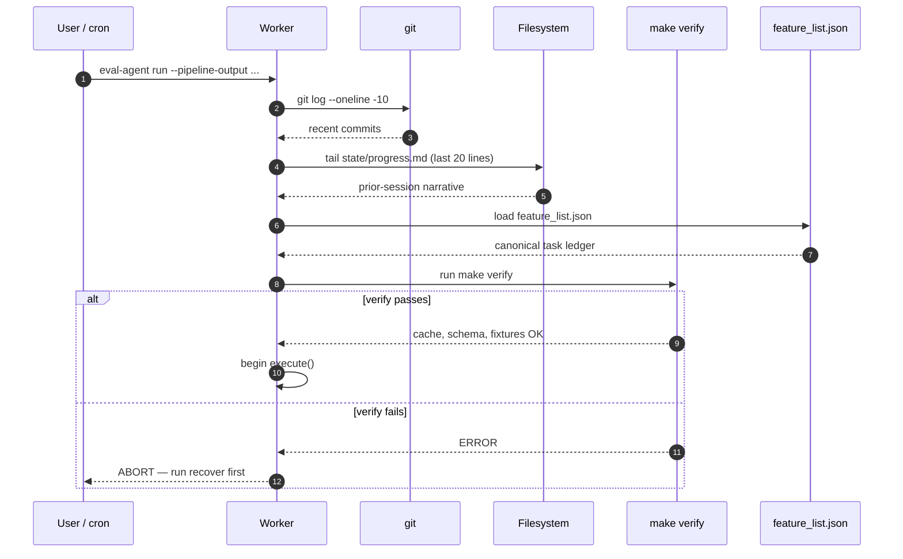

This procedure is **mandatory**. Skipping it is what Anthropic's
research identifies as the most common cause of long-running agents
regressing prior work within 2-3 sessions.

---

## 9 · Verdict schema lifecycle

Schemas are versioned. Every verdict carries its `schema_version`;
old runs remain readable across schema upgrades; migrations are
explicit.

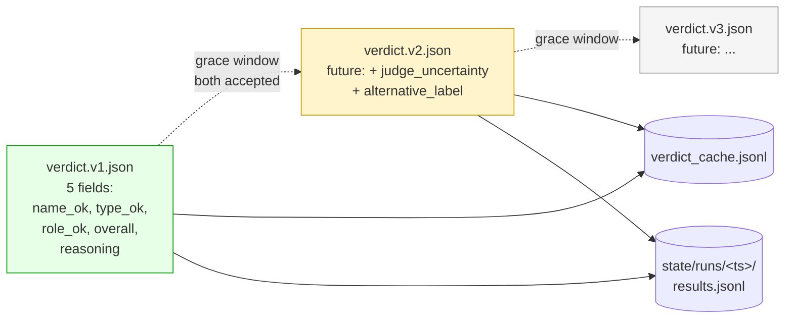

Migration runbook (see `config/schemas/README.md`):

1. Bump `schema_version` integer in a new `verdict.vN.json` file.
2. Verdict cache reader accepts both versions during a grace window.
3. Migration script back-fills v(N-1) entries to vN (where possible).
4. After grace window, dropping older schema is one commit.

---

## 10 · Agentic judging (the tool-loop)

The judge is **agentic by default** (gated). Tier-1 judges every
candidate in a single shot; only `abstain` / `partial` verdicts enter
the ReAct tool-loop, where the model chooses which evidence to gather
(`fetch_marc_field`, `expand_note`, `list_record_entities`,
`lookup_authority`) and escalates to a stronger model once if it stays
uncertain. `--linear` disables the loop (reproducible / citable path);
`--agentic-all` routes every candidate through it.

Each tool dispatch and escalation prints a `[STEP] tool <name>` /
`[STEP] escalate <model>` line; the MHM Pipeline's live agent-flow
diagram animates those nodes in real time.

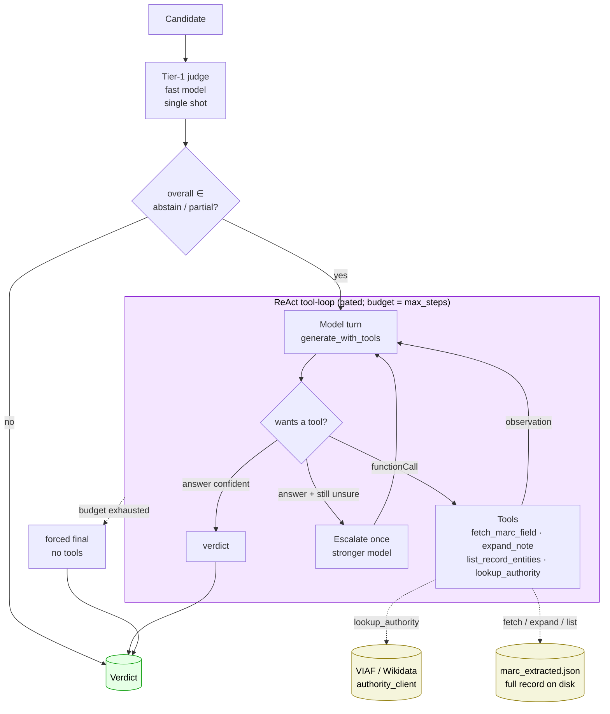

**Invariants:**

- The tool-loop runs inside the eval-agent's own process; tools read
  the pipeline's on-disk JSON or make the eval-agent's OWN network
  calls (VIAF / Wikidata). The file-coupling boundary (section 7) is
  unchanged — no Python imports across.
- Every loop step is recorded to `state/runs/<ts>/traces/<evaluator>.jsonl`
  for audit (the agency is fully traceable).
- The verdict cache key is mode-tagged (`<model>::<mode>`) so agentic
  and linear verdicts never collide. `self_verify` gates on linear
  verdicts only — agentic verdicts re-gather evidence on re-run and
  legitimately diverge, so they are reported separately, non-gating.

---

## 11 · Reading order for a code-walkthrough

If you're reading the code for the first time (e.g. in an interview):

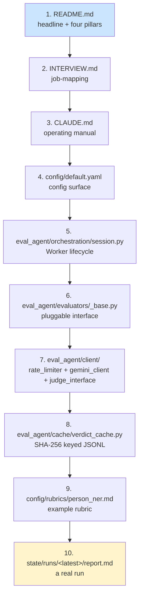
